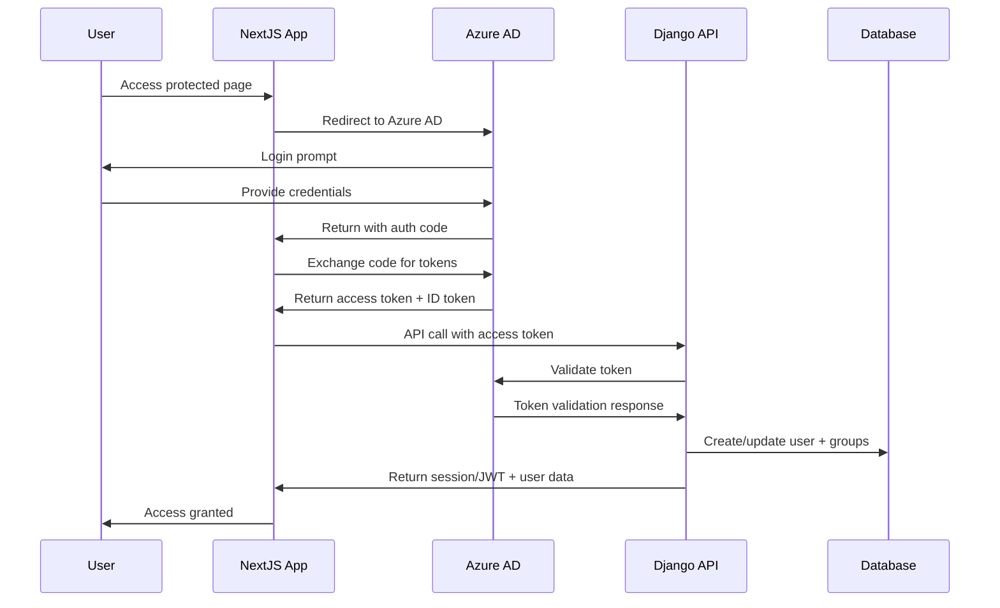

# MTK-Care - Technical Requirements & Implementation Guide

## 1. Technology Stack

### 1.1 Backend Stack
- **Framework**: Django 5.0+
- **API Layer**: Django Ninja 1.0+
- **Authentication**: Azure AD JWT Token Validation
- **Database**: PostgreSQL 14+
- **Python Version**: 3.11+

### 1.2 Frontend Stack
- **Framework**: Next.js 14+ (App Router)
- **Language**: TypeScript 5+
- **Styling**: ShadCN, Tailwind CSS 3+
- **State Management**: TanStack Query (React Query)
- **Authentication**: NextAuth.js 4+

### 1.3 Deployment & Infrastructure
- **Hosting**: Azure Web Apps
- **CI/CD**: GitHub Actions
- **Containerization**: Docker (optional)
- **Testing**: Pytest (backend), Jest (frontend)
- **Monitoring**: Azure Application Insights
- **Code Quality**: Black, isort, ESLint, Prettier
- **Documentation**: OpenAPI/Swagger

## 2. Authentication Architecture

### 2.1 Recommended Authentication Flow



### 2.2 Django Authentication Configuration

```python
# settings/base.py
AUTHENTICATION_BACKENDS = [
    'django_auth_adfs.backend.AdfsAuthCodeBackend',
    'django_auth_adfs.backend.AdfsAccessTokenBackend',
    'django.contrib.auth.backends.ModelBackend',
]

AUTH_ADFS = {
    'AUDIENCE': env('AZURE_CLIENT_ID'),
    'CLIENT_ID': env('AZURE_CLIENT_ID'),
    'CLIENT_SECRET': env('AZURE_CLIENT_SECRET'),
    'TENANT_ID': env('AZURE_TENANT_ID'),
    'RELYING_PARTY_ID': env('AZURE_CLIENT_ID'),
    'CLAIM_MAPPING': {
        'first_name': 'given_name',
        'last_name': 'family_name',
        'email': 'upn',
    },
    'GROUPS_CLAIM': 'roles',  # or 'groups'
    'MIRROR_GROUPS': True,
    'USERNAME_CLAIM': 'upn',
    'CREATE_NEW_USERS': True,
    'BOOLEAN_CLAIM_MAPPING': {
        'is_staff': 'is_admin',
        'is_superuser': 'is_superuser',
    },
}
```

### 2.3 NextJS Authentication Setup

```typescript
// lib/auth.ts
import NextAuth from 'next-auth'
import AzureADProvider from 'next-auth/providers/azure-ad'

export const authOptions = {
  providers: [
    AzureADProvider({
      clientId: process.env.AZURE_AD_CLIENT_ID!,
      clientSecret: process.env.AZURE_AD_CLIENT_SECRET!,
      tenantId: process.env.AZURE_AD_TENANT_ID!,
    }),
  ],
  callbacks: {
    async jwt({ token, account }) {
      if (account) {
        token.accessToken = account.access_token
      }
      return token
    },
    async session({ session, token }) {
      // Send token to Django backend for validation
      const response = await fetch(`${process.env.NEXT_PUBLIC_DJANGO_API_URL}/api/auth/validate`, {
        headers: {
          'Authorization': `Bearer ${token.accessToken}`,
        },
      })
      
      if (response.ok) {
        const userData = await response.json()
        session.user = { ...session.user, ...userData }
      }
      
      return session
    },
  },
}

export default NextAuth(authOptions)
```

## 3. Role-Based Access Control (RBAC)

### 3.1 Django RBAC Implementation

```python
# apps/authentication/decorators.py
from functools import wraps
from django.contrib.auth.decorators import login_required
from django.core.exceptions import PermissionDenied
from django.contrib.auth.models import Group

def require_role(role_name):
    """Decorator to require specific role for view access."""
    def decorator(func):
        @wraps(func)
        @login_required
        def wrapper(request, *args, **kwargs):
            if not request.user.groups.filter(name=role_name).exists():
                raise PermissionDenied(f"Role '{role_name}' required")
            return func(request, *args, **kwargs)
        return wrapper
    return decorator

def require_any_role(*role_names):
    """Decorator to require any of the specified roles."""
    def decorator(func):
        @wraps(func)
        @login_required
        def wrapper(request, *args, **kwargs):
            user_groups = request.user.groups.values_list('name', flat=True)
            if not any(role in user_groups for role in role_names):
                raise PermissionDenied(f"One of these roles required: {role_names}")
            return func(request, *args, **kwargs)
        return wrapper
    return decorator

# Usage in views
@require_role('Administrator')
def admin_only_view(request):
    return {"message": "Admin access granted"}

@require_any_role('Manager', 'Administrator')
def manager_or_admin_view(request):
    return {"message": "Manager or Admin access granted"}
```

### 3.2 Authentication Flow

1. **Frontend Authentication**
   - Next.js frontend uses NextAuth.js with Azure AD provider
   - Users authenticate via Azure AD
   - Access token is stored in HTTP-only cookie

2. **API Authentication**
   - Frontend includes access token in `Authorization: Bearer` header
   - Django backend validates JWT token from Azure AD
   - Custom middleware enforces role-based access control

3. **Environment Variables**
   - `AZURE_AD_TENANT_ID`: Azure AD tenant ID
   - `AZURE_AD_CLIENT_ID`: Frontend application client ID
   - `AZURE_AD_CLIENT_SECRET`: Frontend application client secret
   - `NEXT_PUBLIC_AZURE_AD_BACKEND_API_SCOPE`: Backend API scope (e.g., `api://<backend-app-id>/access_as_user`)

### 3.3 Django Ninja API with RBAC

```python
# api/v1/auth.py
from ninja import Router
from ninja.security import HttpBearer
from django.contrib.auth.models import User
from django_auth_adfs.backend import AdfsAccessTokenBackend

router = Router()

class AzureADAuth(HttpBearer):
    def authenticate(self, request, token):
        backend = AdfsAccessTokenBackend()
        user = backend.authenticate(request, access_token=token)
        return user if user else None

# Apply authentication to all routes in this router
auth = AzureADAuth()

@router.get("/profile", auth=auth)
def get_user_profile(request):
    """Get current user profile with roles."""
    user = request.auth
    return {
        "id": user.id,
        "username": user.username,
        "email": user.email,
        "first_name": user.first_name,
        "last_name": user.last_name,
        "roles": list(user.groups.values_list('name', flat=True)),
        "permissions": list(user.get_all_permissions()),
        "is_staff": user.is_staff,
        "is_superuser": user.is_superuser,
    }

@router.post("/validate")
def validate_token(request):
    """Validate Azure AD token and return user data."""
    # This endpoint is called by NextJS to validate tokens
    if request.auth:
        return get_user_profile(request)
    return {"error": "Invalid token"}, 401
```

### 3.3 Permission-Based API Protection

```python
# api/v1/tasks.py
from ninja import Router
from ninja.pagination import paginate
from django.contrib.auth.models import User
from apps.tasks.models import Task
from apps.authentication.decorators import require_role, require_any_role

router = Router()

def check_task_access(user: User, task: Task, action: str = 'view'):
    """Check if user has permission to perform action on task."""
    # Admin can do everything
    if user.groups.filter(name='Administrator').exists():
        return True
    
    # Manager can manage department tasks
    # if user.groups.filter(name='Manager').exists():
    #     return task.department in user.departments.all()
    
    # Provider/Staff can only access assigned tasks
    if action == 'view':
        return task.assigned_to == user or task.assigned_group in user.groups.all()
    elif action == 'edit':
        return task.assigned_to == user
    
    return False

@router.get("/tasks", auth=auth)
@paginate
def list_tasks(request, status: str = None):
    """List tasks based on user permissions."""
    user = request.auth
    queryset = Task.objects.all()
    
    # Filter based on user role
    if user.groups.filter(name='Administrator').exists():
        # Admin sees all tasks
        pass
    # elif user.groups.filter(name='Manager').exists():
    #     # Manager sees department tasks
    #     queryset = queryset.filter(department__in=user.departments.all())
    else:
        # Provider/Staff see only assigned tasks
        queryset = queryset.filter(
            models.Q(assigned_to=user) | 
            models.Q(assigned_group__in=user.groups.all())
        )
    
    # Apply filters
    if status:
        queryset = queryset.filter(status=status)
    # if department_id:
    #     queryset = queryset.filter(department_id=department_id)
    
    return queryset

@router.post("/tasks", auth=auth)
@require_any_role('Administrator', 'Manager', 'Provider')
def create_task(request, task_data: TaskCreateSchema):
    """Create a new task."""
    user = request.auth
    
    # Check if user can create tasks in specified department
    if not user.groups.filter(name='Administrator').exists():
        # if task_data.department_id not in user.departments.values_list('id', flat=True):
        #     return {"error": "Cannot create tasks in this department"}, 403
    
    task = Task.objects.create(
        **task_data.dict(),
        created_by=user
    )
    return {"id": task.id, "message": "Task created successfully"}

@router.put("/tasks/{task_id}", auth=auth)
def update_task(request, task_id: int, task_data: TaskUpdateSchema):
    """Update an existing task."""
    user = request.auth
    task = get_object_or_404(Task, id=task_id)
    
    if not check_task_access(user, task, 'edit'):
        return {"error": "Permission denied"}, 403
    
    for field, value in task_data.dict(exclude_unset=True).items():
        setattr(task, field, value)
    
    task.updated_by = user
    task.save()
    
    return {"message": "Task updated successfully"}
```

### 3.4 Frontend RBAC Implementation

```typescript
// hooks/useAuth.ts
import { useSession } from 'next-auth/react'

interface UserRole {
  name: string
  permissions: string[]
}

export function useAuth() {
  const { data: session, status } = useSession()
  
  const hasRole = (roleName: string): boolean => {
    return session?.user?.roles?.includes(roleName) || false
  }
  
  const hasAnyRole = (roleNames: string[]): boolean => {
    return roleNames.some(role => hasRole(role))
  }
  
  const hasPermission = (permission: string): boolean => {
    return session?.user?.permissions?.includes(permission) || false
  }
  
  const canAccessTask = (task: any): boolean => {
    if (hasRole('Administrator')) return true
    // if (hasRole('Manager') && task.department_id === session?.user?.department_id) return true
    if (task.assigned_to === session?.user?.id) return true
    return false
  }
  
  return {
    user: session?.user,
    isLoading: status === 'loading',
    isAuthenticated: status === 'authenticated',
    hasRole,
    hasAnyRole,
    hasPermission,
    canAccessTask,
  }
}

// components/ProtectedComponent.tsx
interface ProtectedComponentProps {
  roles?: string[]
  permissions?: string[]
  children: React.ReactNode
  fallback?: React.ReactNode
}

export function ProtectedComponent({ 
  roles, 
  permissions, 
  children, 
  fallback = null 
}: ProtectedComponentProps) {
  const { hasAnyRole, hasPermission } = useAuth()
  
  const hasAccess = () => {
    if (roles && !hasAnyRole(roles)) return false
    if (permissions && !permissions.every(hasPermission)) return false
    return true
  }
  
  return hasAccess() ? <>{children}</> : <>{fallback}</>
}

// Usage example
<ProtectedComponent roles={['Administrator', 'Manager']}>
  <CreateTaskButton />
</ProtectedComponent>
```

## 4. API Design Patterns

### 4.1 Error Handling

```python
# api/exceptions.py
from ninja import NinjaAPI
from ninja.responses import Response
from django.core.exceptions import PermissionDenied, ValidationError
from django.http import Http404

def add_exception_handlers(api: NinjaAPI):
    @api.exception_handler(PermissionDenied)
    def permission_denied(request, exc):
        return Response(
            {"error": "Permission denied", "detail": str(exc)}, 
            status=403
        )
    
    @api.exception_handler(Http404)
    def not_found(request, exc):
        return Response(
            {"error": "Resource not found"}, 
            status=404
        )
    
    @api.exception_handler(ValidationError)
    def validation_error(request, exc):
        return Response(
            {"error": "Validation failed", "detail": exc.message_dict}, 
            status=400
        )
```

### 4.2 Response Schemas

```python
# api/schemas.py
from ninja import Schema
from typing import List, Optional
from datetime import datetime

class UserSchema(Schema):
    id: int
    username: str
    email: str
    first_name: str
    last_name: str
    roles: List[str]
    is_staff: bool

class TaskSchema(Schema):
    id: int
    title: str
    description: Optional[str]
    status: str
    priority: str
    assigned_to: Optional[UserSchema]
    due_date: Optional[datetime]
    created_at: datetime
    updated_at: datetime

class TaskCreateSchema(Schema):
    title: str
    description: Optional[str] = ""
    priority: str = "medium"
    # department_id: int
    assigned_to_id: Optional[int] = None
    due_date: Optional[datetime] = None

class APIResponse(Schema):
    success: bool
    message: str
    data: Optional[dict] = None

class PaginatedResponse(Schema):
    count: int
    next: Optional[str]
    previous: Optional[str]
    results: List[dict]
```

### 4.3 Middleware for Audit Logging

```python
# apps/audit/middleware.py
import json
from django.utils.deprecation import MiddlewareMixin
from django.contrib.auth.models import AnonymousUser
from .models import AuditLog

class AuditTrailMiddleware(MiddlewareMixin):
    def process_response(self, request, response):
        # Only log API calls and POST/PUT/DELETE requests
        if (request.path.startswith('/api/') and 
            request.method in ['POST', 'PUT', 'DELETE', 'PATCH']):
            
            if not isinstance(request.user, AnonymousUser):
                AuditLog.objects.create(
                    user=request.user,
                    action=request.method,
                    resource=request.path,
                    ip_address=self.get_client_ip(request),
                    user_agent=request.META.get('HTTP_USER_AGENT', ''),
                    status_code=response.status_code,
                    request_data=self.get_request_data(request),
                )
        
        return response
    
    def get_client_ip(self, request):
        x_forwarded_for = request.META.get('HTTP_X_FORWARDED_FOR')
        if x_forwarded_for:
            return x_forwarded_for.split(',')[0]
        return request.META.get('REMOTE_ADDR')
    
    def get_request_data(self, request):
        try:
            if hasattr(request, 'data'):
                return json.dumps(request.data)[:1000]  # Limit size
        except:
            pass
        return ""
```

## 5. Database Design

### 5.1 Core Models

```python
# apps/tasks/models.py
from django.db import models
from django.contrib.auth.models import User, Group
from apps.common.models import TimeStampedModel

class Department(TimeStampedModel):
    name = models.CharField(max_length=100, unique=True)
    description = models.TextField(blank=True)
    manager = models.ForeignKey(User, on_delete=models.SET_NULL, null=True)
    is_active = models.BooleanField(default=True)
    
    def __str__(self):
        return self.name

class TaskPriority(models.TextChoices):
    CRITICAL = 'critical', 'Critical'
    HIGH = 'high', 'High'
    MEDIUM = 'medium', 'Medium'
    LOW = 'low', 'Low'

class TaskStatus(models.TextChoices):
    NOT_STARTED = 'not_started', 'Not Started'
    IN_PROGRESS = 'in_progress', 'In Progress'
    REVIEW = 'review', 'Under Review'
    COMPLETED = 'completed', 'Completed'
    CANCELLED = 'cancelled', 'Cancelled'

class Task(TimeStampedModel):
    title = models.CharField(max_length=200)
    description = models.TextField(blank=True)
    status = models.CharField(max_length=15, choices=TaskStatus.choices, default=TaskStatus.NOT_STARTED)
    priority = models.CharField(max_length=10, choices=TaskPriority.choices, default=TaskPriority.MEDIUM)
    assigned_to = models.ForeignKey(User, on_delete=models.SET_NULL, null=True, blank=True, related_name='assigned_tasks')
    assigned_group = models.ForeignKey(Group, on_delete=models.SET_NULL, null=True, blank=True, related_name='assigned_tasks')
    department = models.ForeignKey(Department, on_delete=models.CASCADE, related_name='tasks')
    due_date = models.DateTimeField(null=True, blank=True)
    completed_at = models.DateTimeField(null=True, blank=True)
    tags = models.JSONField(default=list, blank=True)
    
    class Meta:
        ordering = ['-created_at']
        indexes = [
            models.Index(fields=['status', 'priority']),
            models.Index(fields=['assigned_to', 'status']),
            models.Index(fields=['department', 'status']),
            models.Index(fields=['due_date']),
        ]
    
    def __str__(self):
        return self.title
```

## 6. Deployment Configuration

### 6.1 Docker Configuration

```dockerfile
# Dockerfile
FROM python:3.11-slim

ENV PYTHONDONTWRITEBYTECODE=1
ENV PYTHONUNBUFFERED=1

WORKDIR /app

# Install system dependencies
RUN apt-get update && apt-get install -y \
    build-essential \
    libpq-dev \
    && apt-get clean

# Install Python dependencies
COPY requirements/production.txt .
RUN pip install --no-cache-dir -r production.txt

# Copy project
COPY . .

# Collect static files
RUN python manage.py collectstatic --noinput

# Create non-root user
RUN useradd --create-home --shell /bin/bash mtk-care
USER mtk-care

EXPOSE 8000

CMD ["gunicorn", "config.wsgi:application", "--bind", "0.0.0.0:8000"]
```

### 6.2 Environment Configuration

```python
# config/settings/production.py
from .base import *
import sentry_sdk
from sentry_sdk.integrations.django import DjangoIntegration

DEBUG = False

# Security
SECURE_SSL_REDIRECT = True
SECURE_PROXY_SSL_HEADER = ('HTTP_X_FORWARDED_PROTO', 'https')
SECURE_HSTS_SECONDS = 31536000
SECURE_HSTS_INCLUDE_SUBDOMAINS = True
SECURE_HSTS_PRELOAD = True
SECURE_CONTENT_TYPE_NOSNIFF = True
SECURE_BROWSER_XSS_FILTER = True
X_FRAME_OPTIONS = 'DENY'

# Database
DATABASES = {
    'default': {
        'ENGINE': 'django.db.backends.postgresql',
        'NAME': env('DB_NAME'),
        'USER': env('DB_USER'),
        'PASSWORD': env('DB_PASSWORD'),
        'HOST': env('DB_HOST'),
        'PORT': env('DB_PORT', default='5432'),
        'OPTIONS': {
            'sslmode': 'require',
        },
    }
}

# Caching
CACHES = {
    'default': {
        'BACKEND': 'django.core.cache.backends.redis.RedisCache',
        'LOCATION': env('REDIS_URL'),
        'OPTIONS': {
            'CLIENT_CLASS': 'django_redis.client.DefaultClient',
        },
        'KEY_PREFIX': 'mtk_care',
        'TIMEOUT': 300,
    }
}

# Error tracking
sentry_sdk.init(
    dsn=env('SENTRY_DSN', default=''),
    integrations=[DjangoIntegration()],
    traces_sample_rate=0.1,
)

# Email
EMAIL_BACKEND = 'django.core.mail.backends.smtp.EmailBackend'
EMAIL_HOST = env('EMAIL_HOST')
EMAIL_PORT = env('EMAIL_PORT', default=587)
EMAIL_USE_TLS = True
EMAIL_HOST_USER = env('EMAIL_HOST_USER')
EMAIL_HOST_PASSWORD = env('EMAIL_HOST_PASSWORD')
```

This technical requirements document provides the concrete implementation details for building MTK-Care with the recommended authentication flow and RBAC system using Django Ninja and django-auth-adfs.