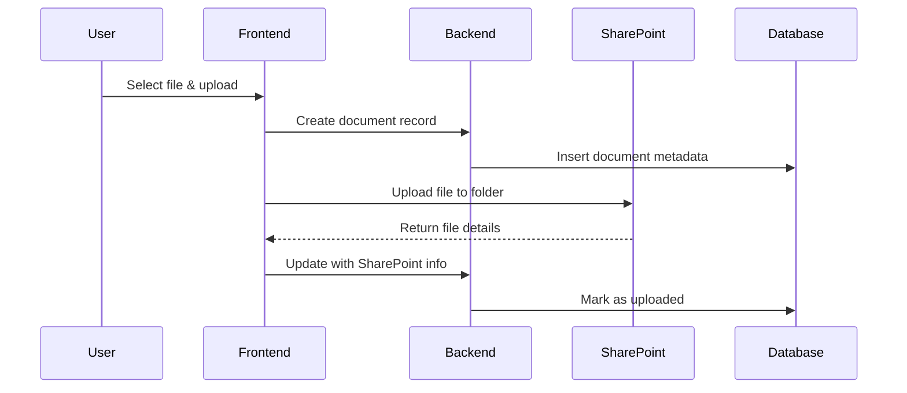

# SharePoint Integration - Production Technical Summary

## High-Level Architecture

### Frontend (Next.js/React)
```typescript
PnP SharePoint Framework (SPFx) Integration
├── @pnp/sp (SharePoint REST API)
├── @pnp/nodejs (Node.js support)  
├── @pnp/logging (Debugging)
└── Authentication Layer
```

### Backend (Django)
```python
Microsoft Graph API Integration
├── msal (Microsoft Authentication Library)
├── requests (HTTP client)
├── django-environ (Config management)
└── Document Model (Metadata tracking)
```

---

## 🔐 Authentication Methods

### Option 1: Frontend Authentication (Client-Side)
```typescript
// Azure AD MSAL Browser
import { PublicClientApplication } from "@azure/msal-browser";
import { spfi, SPFx } from "@pnp/sp";

const msalInstance = new PublicClientApplication({
  auth: {
    clientId: process.env.NEXT_PUBLIC_AZURE_CLIENT_ID,
    authority: "https://login.microsoftonline.com/[tenant-id]"
  }
});

// SPFx Context with MSAL
const sp = spfi().using(SPFx({ 
  msalInstance,
  scope: "https://manaakitech.sharepoint.com/.default"
}));
```

### Option 2: Backend Proxy (Server-Side) ⭐ *Recommended*
```python
# Django backend with MSAL
from msal import ConfidentialClientApplication
import requests

app = ConfidentialClientApplication(
    client_id=settings.AZURE_CLIENT_ID,
    client_secret=settings.AZURE_CLIENT_SECRET,
    authority=f"https://login.microsoftonline.com/{settings.AZURE_TENANT_ID}"
)

# Get access token
result = app.acquire_token_silent(
    scopes=["https://graph.microsoft.com/.default"],
    account=None
)
```

---

## 📁 File Operations Implementation

### Core SharePoint Operations
```typescript
// Frontend PnP Operations
export class SharePointService {
  
  // List files in client folder
  async listClientDocuments(clientId: string, referralId?: string) {
    const folderPath = `/sites/client_docs/Shared Documents/${clientId}/${referralId ? `referrals/${referralId}` : 'general'}`;
    
    const folder = this.sp.web.getFolderByServerRelativePath(folderPath);
    return await folder.files();
  }
  
  // Upload file with automatic folder creation
  async uploadDocument(clientId: string, file: File, referralId?: string) {
    const folderPath = this.getFolderPath(clientId, referralId);
    
    // Ensure nested folders exist
    await this.ensureFolderStructure(folderPath);
    
    const folder = this.sp.web.getFolderByServerRelativePath(folderPath);
    return await folder.files.addUsingPath(file.name, file, { 
      Overwrite: true 
    });
  }
  
  // Create nested folder structure
  private async ensureFolderStructure(path: string) {
    const folders = path.split('/').filter(Boolean);
    let currentPath = '/sites/client_docs/Shared Documents';
    
    for (const folder of folders.slice(3)) { // Skip base path
      currentPath += `/${folder}`;
      try {
        await this.sp.web.folders.addUsingPath(currentPath);
      } catch (error) {
        // Folder exists - continue
      }
    }
  }
}
```

---

## 🗄️ Database Integration

### Document Metadata Tracking
```python
# Django Document Model
class Document(UUIDPKBaseModel):
    # File metadata
    file_name = models.CharField(max_length=255)
    file_size = models.PositiveBigIntegerField(null=True)
    mime_type = models.CharField(max_length=100, null=True)
    
    # SharePoint integration
    sharepoint_id = models.CharField(max_length=255, null=True)
    sharepoint_url = models.URLField(max_length=500, null=True)
    
    # Folder organization
    client_id = models.UUIDField(null=True)
    referral_id = models.UUIDField(null=True)
    folder_category = models.CharField(max_length=50, default='general')
    
    # Upload tracking
    status = models.CharField(max_length=20, choices=[
        ('pending', 'Pending Upload'),
        ('uploading', 'Uploading'),
        ('uploaded', 'Uploaded Successfully'),
        ('failed', 'Upload Failed'),
    ])
    
    @property
    def sharepoint_folder_path(self) -> str:
        """Generate SharePoint path: /{client_id}/referrals/{referral_id}/"""
        if self.referral_id:
            return f"{self.client_id}/referrals/{self.referral_id}/"
        return f"{self.client_id}/general/"
```

---

## 🔄 Production Workflow

### Upload Process


### Folder Structure
```
/sites/client_docs/Shared Documents/
├── {client-uuid-1}/
│   ├── general/
│   │   ├── id-documents/
│   │   └── medical-records/
│   └── referrals/
│       ├── {referral-uuid-1}/
│       │   ├── consent-forms.pdf
│       │   └── assessments.docx
│       └── {referral-uuid-2}/
└── {client-uuid-2}/
    └── general/
        └── court-orders/
```

---

## ⚙️ Configuration Requirements

### Azure AD App Registration
```yaml
Required Permissions:
  - Sites.ReadWrite.All (SharePoint)
  - Files.ReadWrite.All (OneDrive/SharePoint)
  - User.Read (Basic profile)

Authentication:
  - Single Page Application (SPA) - for frontend
  - Web Application - for backend proxy
  
Redirect URIs:
  - https://your-app.com/auth/callback
  - http://localhost:3000/auth/callback (dev)
```

### Environment Variables
```bash
# Frontend (.env.local)
NEXT_PUBLIC_AZURE_CLIENT_ID=your-client-id
NEXT_PUBLIC_AZURE_TENANT_ID=your-tenant-id
NEXT_PUBLIC_SHAREPOINT_SITE_URL=https://manaakitech.sharepoint.com/sites/client_docs

# Backend (.env)
AZURE_CLIENT_ID=your-client-id
AZURE_CLIENT_SECRET=your-client-secret
AZURE_TENANT_ID=your-tenant-id
SHAREPOINT_SITE_URL=https://manaakitech.sharepoint.com/sites/client_docs
```

---

## 🔧 Production Libraries

### NPM Dependencies
```json
{
  "@pnp/sp": "^3.19.0",
  "@pnp/nodejs": "^3.19.0", 
  "@azure/msal-browser": "^3.5.0",
  "@azure/msal-react": "^2.0.0"
}
```

### Python Dependencies
```txt
msal==1.25.0
requests==2.31.0
python-dotenv==1.0.0
```

---

## 🚀 Deployment Strategy

### Frontend Deployment
- **Azure Static Web Apps** or **Vercel**
- Environment variables configured in hosting platform
- CORS enabled for SharePoint domain

### Backend Deployment
- **Azure App Service** or **Azure Container Instances**
- Managed Identity for Azure resource access
- Key Vault integration for secrets

### SharePoint Setup
- Document library: `/sites/client_docs/Shared Documents`
- Permissions: App-only or delegated based on requirements
- Content types configured for document metadata

---

## 🔒 Security Considerations

### Access Control
- **Principle of Least Privilege**: Grant minimum required permissions
- **App-only Authentication**: Recommended for backend services
- **Conditional Access**: Enforce location/device restrictions
- **Multi-factor Authentication**: Required for admin accounts

### Data Protection
- **Encryption in Transit**: HTTPS/TLS for all communications
- **Encryption at Rest**: SharePoint automatic encryption
- **Access Logging**: Audit all document access and modifications
- **Data Classification**: Tag documents with sensitivity levels

### Compliance
- **GDPR Compliance**: Document retention and deletion policies
- **Healthcare Standards**: HIPAA/SOX compliance if applicable
- **Access Reviews**: Regular permission audits
- **Backup Strategy**: SharePoint Online automatic backups

---

## 📊 Monitoring & Analytics

### Logging
```python
# Django logging configuration
LOGGING = {
    'loggers': {
        'sharepoint.operations': {
            'handlers': ['file', 'console'],
            'level': 'INFO',
            'propagate': False,
        },
    }
}

# Log all SharePoint operations
logger.info(f"Document uploaded: {file_name} to {folder_path} by {user.email}")
```

### Metrics to Track
- Upload success/failure rates
- File size distribution
- User activity patterns
- Storage usage trends
- API response times
- Authentication failures

---

## 🛠️ Development vs Production

### Development Setup
- Mock SharePoint service for local testing
- Auth bypass mode for development
- Local file storage simulation
- Debug logging enabled

### Production Setup
- Real SharePoint integration
- Azure AD authentication required
- Production SharePoint site
- Minimal logging for performance
- Health checks and monitoring
- Automated deployment pipelines

This architecture provides secure, scalable file management with full audit trails and proper folder organization for manaakitech's client document requirements.