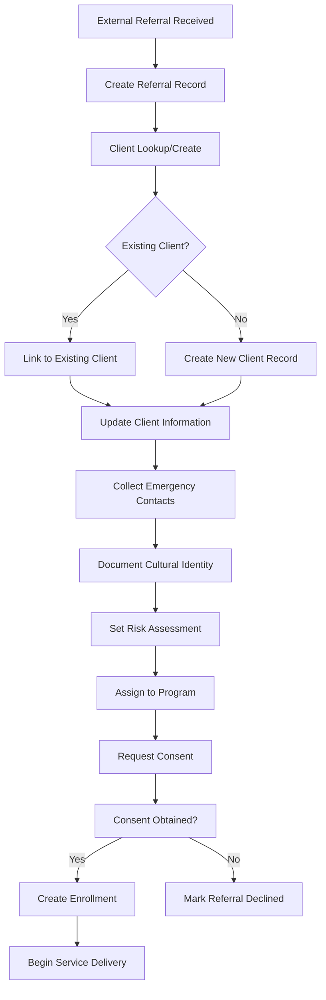
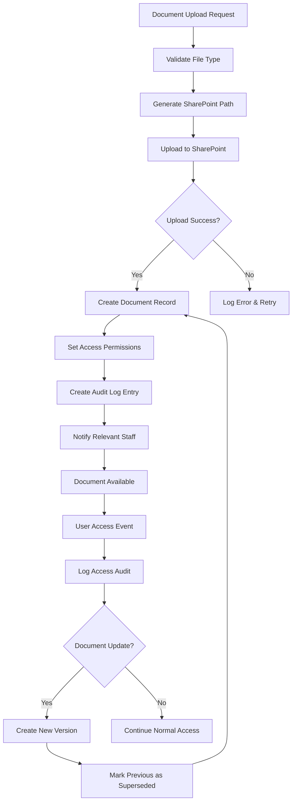
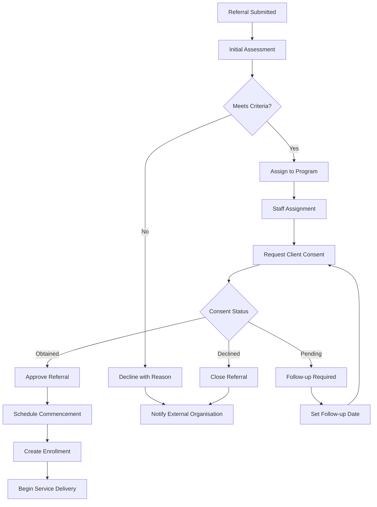
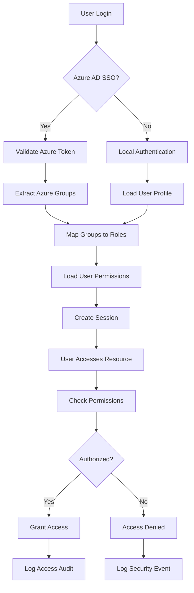
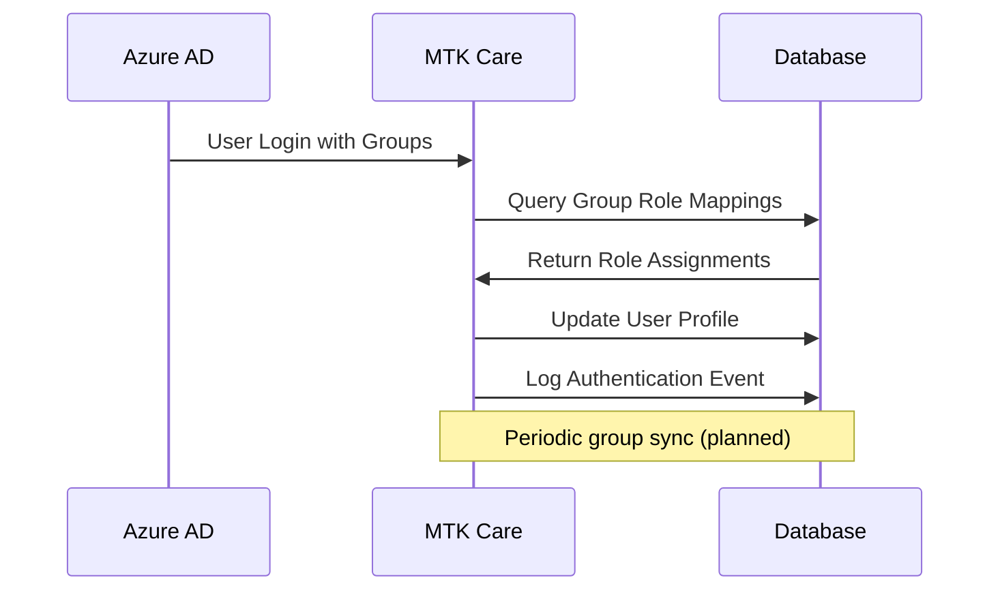
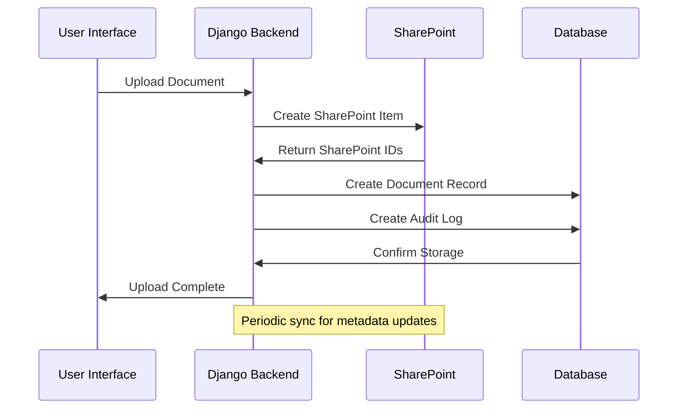
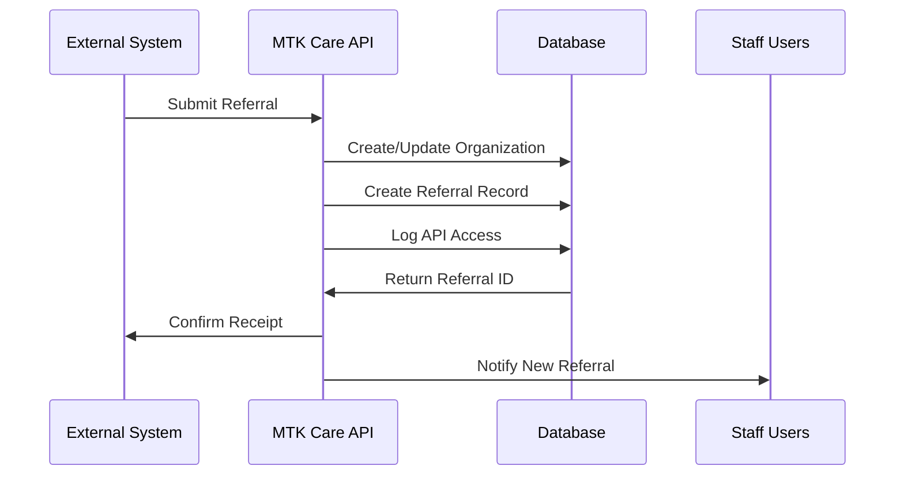

# MTK Care Data Flow Analysis

## Overview

This document describes how data flows through the MTK Care system, from initial client contact through service completion. The system supports multiple entry points and complex workflows while maintaining data integrity and audit trails.

## Primary Data Flow Patterns

### 1. Client Onboarding Flow



**Key Tables Involved**:
- `referral_management_Referral` (entry point)
- `client_management_Client` (central entity)
- `client_management_ClientEmergencyContact`
- `referral_management_ConsentRecord`
- `programs_Enrolment`

### 2. Document Lifecycle Flow



**Key Tables Involved**:
- `common_Document` (central document metadata)
- `common_DocumentAuditLog` (access tracking)
- SharePoint integration (external storage)

### 3. Referral Processing Workflow



**Key Tables Involved**:
- `referral_management_Referral` (workflow state)
- `referral_management_ConsentRecord` (consent tracking)
- `programs_Enrolment` (service enrollment)
- `external_organisation_management_ExternalOrganisation` (notifications)

### 4. User Authentication & Authorization Flow



**Key Tables Involved**:
- `users_User` (authentication)
- `users_UserProfile` (extended profile)
- `users_Role` (role definitions)
- `users_GroupRoleMapping` (Azure AD integration)
- `audit_AuditLog` (access logging)

## Data Synchronization Patterns

### 1. Azure AD Integration



### 2. SharePoint Document Sync



### 3. External Organization Updates



## Data Validation & Integrity Patterns

### 1. Business Rule Enforcement

**Client Data Validation**:
- Date of birth must be in the past
- Risk level must be valid enum value
- Primary language must exist in reference data
- Emergency contacts require phone number

**Referral Validation**:
- Referral date cannot be in future
- Client consent required for most services
- Program assignment must match service type
- Staff assignment requires active user

**Document Validation**:
- File type must be in allowed list
- Client/referral must exist before document upload
- Access level must match user permissions
- SharePoint path must follow naming convention

### 2. Audit Trail Consistency

**Universal Audit Pattern**:
```sql
-- Every business operation creates audit records
INSERT INTO audit_auditlog (user_id, action, resource, resource_id, timestamp)
VALUES (current_user_id, 'CREATE', 'Client', new_client_id, NOW());

-- Model-level audit fields updated automatically
UPDATE client_management_client 
SET updated_at = NOW(), updated_by = current_user_id
WHERE id = target_client_id;
```

### 3. Soft Delete Cascade

When a record is soft-deleted, related records follow business rules:
- **Client deletion**: Referrals remain but marked as orphaned
- **Program deletion**: Enrollments retained for historical reporting
- **User deletion**: Created records retain user reference for audit

## Performance Optimization Patterns

### 1. Query Optimization

**Common Query Patterns**:
```sql
-- Client with all related data (single query)
SELECT c.*, ec.*, r.* 
FROM client_management_client c
LEFT JOIN client_management_clientemergencycontact ec ON c.id = ec.client_id
LEFT JOIN referral_management_referral r ON c.id = r.client_id
WHERE c.is_deleted = false;

-- Active referrals with program details
SELECT r.*, p.name as program_name, u.first_name as staff_name
FROM referral_management_referral r
JOIN programs_program p ON r.target_program_id = p.id
LEFT JOIN users_user u ON r.assigned_staff_id = u.id
WHERE r.is_deleted = false AND r.status IN ('ACTIVE', 'PENDING');
```

### 2. Caching Strategy

**Django Model Caching**:
- Option lists cached for 1 hour
- User permissions cached per session
- Program configurations cached until updated
- Reference data cached for 24 hours

### 3. Bulk Operations

**Batch Processing Patterns**:
- Document uploads processed in batches
- Consent record creation for multiple clients
- Notification dispatch using bulk operations
- Report generation with optimized queries

## Integration Data Flows

### 1. External Referral Sources

**Inbound Flow**:
1. External system POST to `/api/v1/referrals/`
2. Validate organization credentials
3. Create/update external organization record
4. Create referral with pending status
5. Notify assigned staff via notification system
6. Return confirmation with tracking ID

### 2. Reporting & Analytics

**Data Extraction Flow**:
1. Scheduled report generation
2. Query optimization with read replicas (future)
3. Data aggregation with privacy filtering
4. Export to business intelligence tools
5. Audit log all data access

### 3. Compliance Reporting

**Audit Data Flow**:
1. Continuous audit log collection
2. Compliance rule evaluation
3. Exception reporting and alerts
4. Data retention policy enforcement
5. Secure archive for long-term storage

## Error Handling & Recovery

### 1. Data Consistency Recovery

**Transaction Rollback Scenarios**:
- SharePoint upload failure → Rollback document record
- Azure AD sync failure → Maintain local role cache
- External API timeout → Queue for retry with exponential backoff

### 2. Data Migration Patterns

**Schema Evolution Strategy**:
1. Create new fields with defaults
2. Migrate data in batches during maintenance windows
3. Update application code to use new fields
4. Deprecate old fields with warning period
5. Remove old fields in subsequent release

### 3. Backup & Recovery

**Data Protection Flow**:
1. Automated database backups every 6 hours
2. SharePoint versioning for document recovery
3. Point-in-time recovery for data corruption
4. Cross-region replication for disaster recovery
5. Audit log preservation for 7+ years

## Business Intelligence Data Flow

### 1. Operational Reporting

**Real-time Dashboards**:
- Active referral counts by status
- Program enrollment trends
- Staff workload distribution
- Document compliance tracking

### 2. Analytics Pipeline

**Data Warehouse Flow** (Future Implementation):
1. Nightly ETL from operational database
2. Data cleansing and transformation
3. Dimensional modeling for analysis
4. Business intelligence tool integration
5. Self-service analytics for managers

This data flow analysis provides the foundation for understanding how information moves through the MTK Care system and supports business operations, compliance requirements, and future scalability needs.